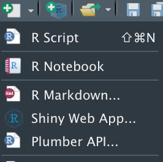

# Plumber Lunch & Learn

We created a demo plumber API from RStudio using the new content menu.

We talked about how:

- Running Plumber APIs generates swagger documentation automatically
- How Plumber APIs are useful when you want to share R resources with other developers
- How Plumber APIs are useful for interacting with webhook systems
